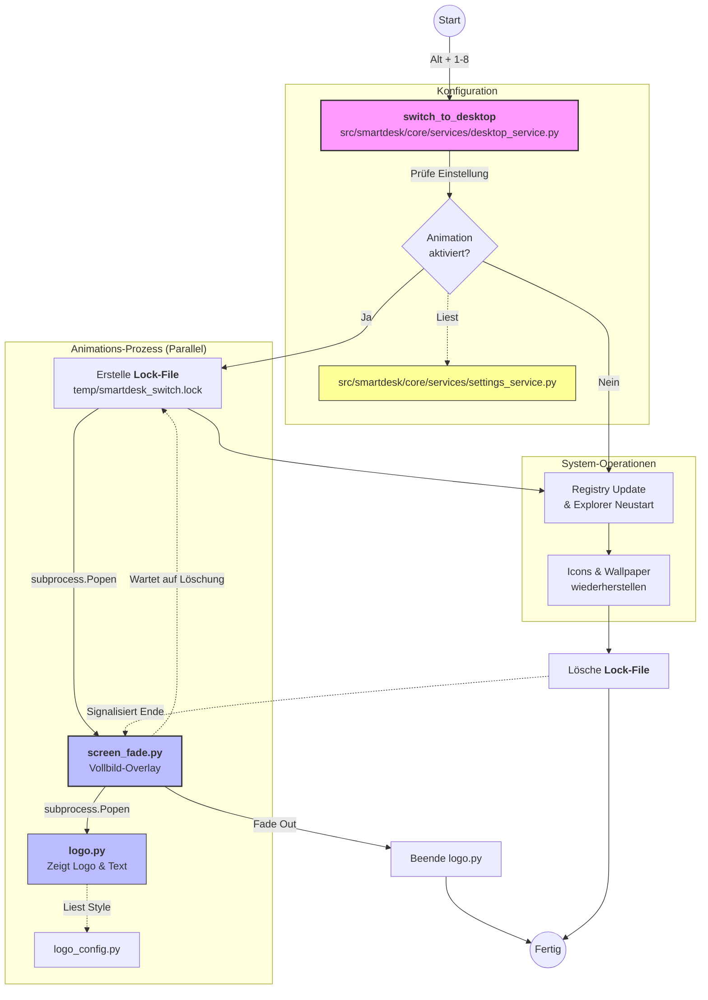

# Dokumentation: Desktop-Wechsel Prozess

Diese Datei beschreibt den technischen Ablauf beim Wechseln eines Desktops in SmartDesk, damit zukünftige Änderungen an der Animation oder dem Ablauf leichter nachvollzogen werden können.

## Flowchart: Ablauf & Logik

## Relevante Dateien & Verantwortlichkeiten

| Datei-Pfad | Verantwortung |
| :--- | :--- |
| **`src/smartdesk/core/services/desktop_service.py`** | **Hauptsteuerung:** Enthält `switch_to_desktop`. Steuert Registry-Updates, Explorer-Restart und entscheidet über den Start der Animation. |
| **`src/smartdesk/core/services/settings_service.py`** | **Konfiguration:** Verwaltet die Einstellung `show_switch_animation`. |
| **`src/smartdesk/shared/animations/screen_fade.py`** | **Vollbild-Blende:** Erzeugt das Overlay-Fenster. Wartet auf die Löschung der `.lock` Datei im Temp-Verzeichnis, um sich zu beenden. |
| **`src/smartdesk/shared/animations/logo.py`** | **Logo-Anzeige:** Wird von `screen_fade.py` gestartet und zeigt das visuelle Logo/Ladeanimation an. |
| **`src/smartdesk/shared/animations/logo_config.py`** | **Design-Settings:** Zentrale Stelle für Farben, Texte und Animations-Stile des Logos. |
| **`src/smartdesk/ui/gui/pages/settings_page.py`** | **Benutzeroberfläche:** Stellt die Checkbox in den Einstellungen bereit. |

## Einstellung "Blende anzeigen"
Die Einstellung wird in der `settings.json` unter dem Schlüssel `show_switch_animation` (Boolean) gespeichert. Standardmäßig ist dieser Wert auf `true` gesetzt.
