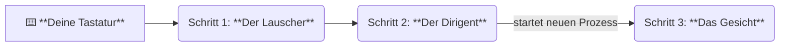

# 🚀 Hotkey-Architektur: Vom Klick zum Fenster

Hier ist der simple Bauplan, wie die `Strg + Shift + Alt` Funktion gebaut ist.
Alles ist in drei super klare, getrennte Schritte aufgeteilt, damit man nicht den Faden verliert.

---

## 🗺️ Die Übersicht: Der Weg in 3 Schritten

Das Ganze funktioniert wie eine Staffelübergabe:

---

## 🛠️ Die Bauteile im Detail

### Schritt 1: 👂 Der Lauscher
> **Datei:** `src/smartdesk/hotkeys/listener.py`

| Was? | Beschreibung |
| :--- | :--- |
| **Job** | **Nur Zuhören.** Er wartet auf genau eine Tastenkombination. |
| **Ablauf** | 🕵️‍♂️ Erkennt `Strg + Shift`, dann wartet er auf `Alt`. |
| **Wichtig**| **Er ist "dumm".** Er weiß nicht, *was* er auslöst. Er ruft nur den nächsten im Team an. |

---

### Schritt 2: 🧠 Der Dirigent
> **Datei:** `src/smartdesk/hotkeys/banner_controller.py`

| Was? | Beschreibung |
| :--- | :--- |
| **Job** | **Denken & Entscheiden.** Er ist das Gehirn der Operation. |
| **Ablauf** | ⏱️ Startet einen Timer, wenn `Alt` gedrückt wird.   ✅ Löst die Anzeige erst aus, wenn die Zeit abgelaufen ist. |
| **Der Trick** | 🚀 **Startet die UI in einem neuen Prozess.** Das ist super wichtig, damit nichts einfriert! |

---

### Schritt 3: ✨ Das Gesicht
> **Datei:** `src/smartdesk/ui/gui/smartdesk_overview_window.py`

| Was? | Beschreibung |
| :--- | :--- |
| **Job** | **Gut aussehen.** Das ist das Fenster, das du am Ende siehst. |
| **Ablauf** | 🎨 Zeigt die Desktop-Übersicht an.   🎬 Kümmert sich um die Animationen (Auf- und Zuklappen). |
| **Wichtig**| **Ist eigenständig.** Es kümmert sich um sein eigenes Aussehen und Verhalten (z.B. Schließen mit `ESC`). |

---

## 🔧 Wie tausche ich die UI aus?

Du willst ein anderes Fenster anzeigen lassen? Ganz einfach.
Du musst **nur dem Dirigenten** sagen, dass er ein anderes Stück auführen soll.

**1. Öffne die Datei des Dirigenten:**
-   `src/smartdesk/hotkeys/banner_controller.py`

**2. Finde das "Drehbuch":**
-   Suche in der Datei nach der Text-Variable `banner_script`.

**3. Tausche das Drehbuch aus:**
-   Ersetze den Inhalt dieser Variable mit dem Code, der dein neues Fenster startet.

**Fertig.** Der Lauscher und das Gesicht müssen davon nichts wissen. Nur der Dirigent entscheidet, was gezeigt wird.
