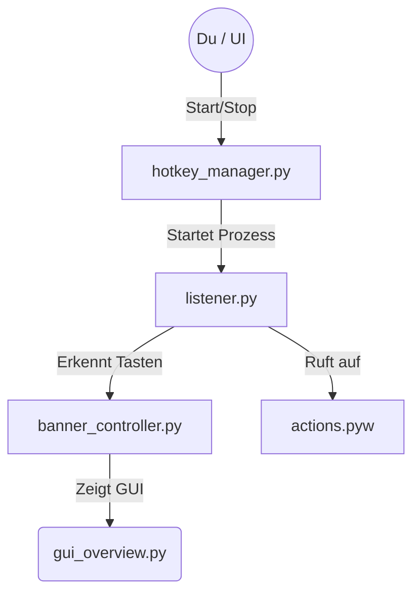

# 🎹 SmartDesk Hotkey System – Dokumentation & Handbuch

> Willkommen im Maschinenraum deines Hotkey-Systems! Diese Dokumentation hilft dir zu verstehen, wie die Teile ineinandergreifen und wo du schrauben musst, um Dinge zu ändern.

---

## 🏗️ Der Überblick: Wie alles zusammenhängt

Stell dir das System wie ein Team vor, in dem jeder eine klare Rolle hat:

-   **Der Manager (`hotkey_manager`)**: Der Chef. Er sagt "Arbeit starten" oder "Feierabend machen" und läuft in deiner Haupt-App.
-   **Der Listener (`listener.py`)**: Der Wachmann. Er sitzt in einem eigenen Prozess und achtet ausschließlich auf Tastendrücke.
-   **Die Aktionen (`actions.pyw`)**: Die Handwerker. Wenn der Wachmann ein Signal gibt, führen sie die eigentliche Arbeit aus (z.B. den Desktop wechseln).

---

## 📂 Datei-Guide: Wer macht was?

> Hier ist deine Schnellanleitung zu den wichtigsten Dateien im System.

### 1. Die Kommandozentrale (Management)

#### `hotkey_manager.py` (Die Fernbedienung)
-   **Was es tut**: Die öffentliche Schnittstelle des Systems. Hier rufst du `start_listener()` oder `stop_listener()` auf.
-   **Besonderheit**: Es benutzt das **Singleton Pattern** – es wird sichergestellt, dass es immer nur einen Chef gibt.

#### `listener_manager.py` (Der Verwalter)
-   **Was es tut**: Enthält die eigentliche Logik für Start/Stop. Es prüft, ob Python verfügbar ist, schreibt die PID-Datei (Prozess-ID) und kümmert sich um das saubere Beenden von Prozessen.
-   **Für Lernzwecke**: Ein gutes Beispiel für **Dependency Injection** (Klassen, die andere Klassen als flexible Bausteine erhalten).

#### `implementations.py` (Die Werkzeugkiste)
-   **Was es tut**: Hier findet die "echte" Arbeit im Hintergrund statt.
-   **Bestandteile**:
    -   `PsutilProcessController`: Nutzt `psutil`, um Prozesse zu überwachen und zu beenden.
    -   `FilePidStorage`: Schreibt die Prozess-ID (PID) in eine Textdatei.
    -   `SubprocessStarter`: Startet den Python-Listener-Prozess.

#### `interfaces.py` (Die Baupläne)
-   **Was es tut**: Definiert abstrakte Regeln (Protokolle), z.B. `"Jeder Starter muss eine start() Funktion haben"`. Enthält keine Logik, sorgt aber für sauberen und austauschbaren Code.

### 2. Der Arbeiter (Der Listener-Prozess)

#### `listener.py` (Das Ohr 👂)
-   **Was es tut**: Das Herzstück, das im Hintergrund läuft. Es verwendet `pynput`, um Tastatur-Events systemweit abzufangen.
-   **Logik**: Wartet auf `Strg` + `Shift`. Wenn diese gehalten werden, wird auf die `Alt`-Taste gewartet, um das Banner zu aktivieren.

#### `banner_controller.py` (Das Gehirn des Banners 🧠)
-   **Was es tut**: Eine simple, aber effektive **State Machine** (Zustandsmaschine), die entscheidet, wann das Hotkey-Banner angezeigt wird.
-   **Ablauf**: *"Wurde `Alt` gedrückt? Halte ich die Taste schon 0.3 Sekunden? Dann zeig das Banner an!"*

#### `actions.pyw` (Die Muskeln 💪)
-   **Was es tut**: Hier passiert die Magie auf dem Desktop. Diese Datei enthält die Funktionen, die bei erkannten Hotkeys ausgeführt werden.
-   **Wichtig**: Importiert die SmartDesk-Services, um Aktionen wie den Desktop-Wechsel durchzuführen.

---

## 🛠️ Handbuch: Wo muss ich was ändern?

> Hier sind die häufigsten Szenarien ("Use Cases"), wenn du am Code basteln willst.

### 🎯 Szenario A: "Ich will, dass bei `Alt`+`1` etwas anderes passiert!"

1.  **Datei öffnen**: `actions.pyw`
2.  **Funktion finden**: Suche nach `def aktion_alt_1():`.
3.  **Code ändern**: Ändere den Inhalt der Funktion.
    -   **Beispiel**: Ersetze `_switch_to_desktop_by_index(0)` durch `print("Hallo Welt")` zum Testen.

### ⏱️ Szenario B: "Das Banner soll schneller erscheinen!"

1.  **Datei öffnen**: `banner_controller.py`
2.  **Klasse finden**: Suche die `BannerConfig` Klasse.
3.  **Wert ändern**: Passe `hold_duration_sec` an.
    -   **Aktuell**: `0.3` (Sekunden)
    -   **Änderung**: Setze den Wert auf `0.1` für ein fast sofortiges Erscheinen.

### ⌨️ Szenario C: "Ich will `Strg`+`F9` als Aktivierungstaste!"

1.  **Datei öffnen**: `listener.py`
2.  **Funktion finden**: Suche die `on_press` Funktion.
3.  **Logik anpassen**: Ändere den Block `if ctrl_held and shift_held ...`, um auf andere Tasten oder Kombinationen zu prüfen, z.B. nur auf `Key.f9`.

### 🐛 Szenario D: "Der Prozess startet nicht oder stürzt heimlich ab."

1.  **Log-Datei prüfen**: Öffne die Datei `listener.log`, die im Datenverzeichnis deines Programms erstellt wird.
2.  **Fehler suchen**: Da der Listener-Prozess im Hintergrund läuft, siehst du Fehler nicht direkt in der Konsole. Die Log-Datei fängt alle Python-Fehler (Tracebacks) auf.

---

## 🎓 Python-Lernecke: Coole Konzepte in diesem Projekt

> Wenn du Python lernst, achte in diesen Dateien auf folgende wiederverwendbare Konzepte:

-   **Dependency Injection** (`listener_manager.py`):
    Statt `psutil` direkt zu nutzen, bekommt der Manager ein "Ding, das Prozesse kontrollieren kann". Das macht den Code extrem flexibel und einfach zu testen.

-   **Singleton Pattern** (`hotkey_manager.py`):
    Die Funktion `_get_manager()` sorgt dafür, dass die `ListenerManager` Klasse nur ein einziges Mal existiert, egal wie oft du sie aufrufst. Das verhindert Konflikte.

-   **Threading** (`banner_controller.py`):
    Damit das Warten auf die "0.3 Sekunden `Alt`-Taste" nicht das ganze Programm blockiert, läuft ein Timer in einem separaten, leichtgewichtigen **Thread**.

-   **Try-Import-Fallback** (`actions.pyw`):
    Der Code versucht, die Haupt-Module zu importieren. Wenn das fehlschlägt (z.B. beim Testen), werden "Fake"-Funktionen definiert, damit das Skript nicht abstürzt. Sehr robust!

---

## ✅ Checkliste vor Änderungen

> Bevor du etwas am Code änderst, stelle dir diese Fragen:

-   [ ] **Läuft der Listener noch?**
    > Stoppe ihn am besten vorher über dein Tray-Icon oder den Task-Manager, um Konflikte zu vermeiden.

-   [ ] **Habe ich `actions.pyw` auf Fehler geprüft?**
    > Ein Fehler hier bringt den Hintergrundprozess zum Absturz, ohne dass du es merkst (Silent Crash).

-   [ ] **Habe ich an die Imports gedacht?**
    > Wenn du neue Module brauchst, denke daran, dass der Listener in einem völlig eigenen Prozess läuft. Er muss ebenfalls Zugriff auf diese Module haben.
